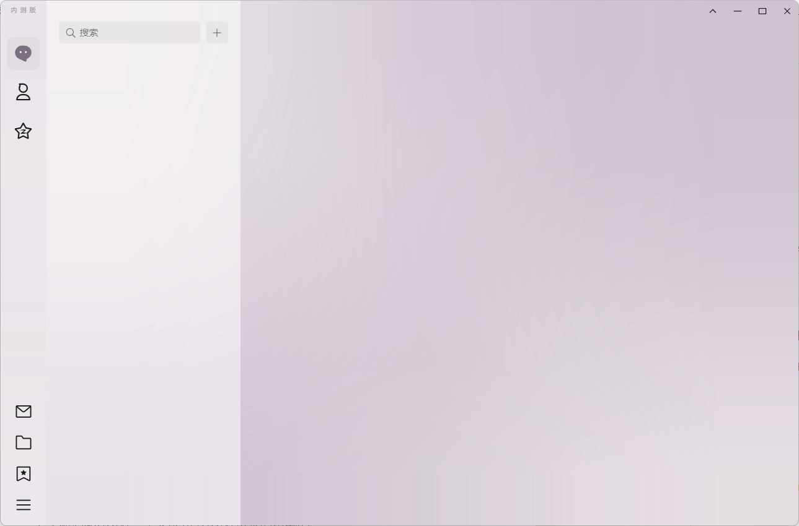

# remove_nav_sidebar
### 删除QQNT版本左边导航栏的按钮

**2023年6月27日，QQ云控增加了QQ游戏中心这个按钮，我个人对于此十分反感，而且QQ不提供侧边栏的个性化定制，于是就有了这个插件。**

目前写的比较简陋，主要功能就是移除侧边栏按钮，不过能用就行。可以看代码自行更改，代码都写了较为详尽的注释。

### 使用方法（2023年7月16日重命名）
- `git clone`或下载zip文件解压，将文件夹移动至`LiteLoaderQQNT数据目录/plugins/`目录下。
- 打开`renderer.js`,然后修改`const removeIndexes = [3,4,5,6];`的内容，具体可看代码注释，里面写的非常清楚。
- 重启QQNT或者打开[Chii DevTools的控制台](https://github.com/mo-jinran/chii-devtools)然后按下 `Ctrl+R` 刷新一下即可生效

P.S. 由于本项目的特殊性，必要时会删库跑路😂

## 开源协议

[MIT License](./LICENSE)  
Copyright (c) 2023 FW27623
